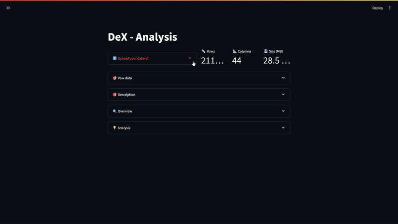
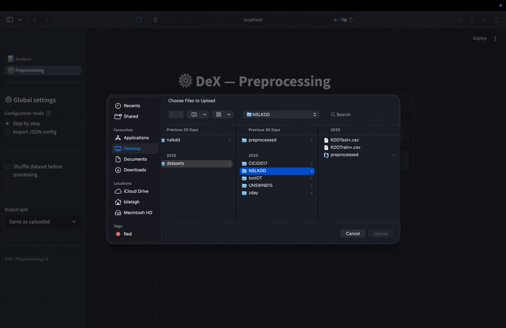

## DeX - Data explorer


[](https://opensource.org/licenses/MIT)

[](https://github.com/psf/black)
[](https://pycqa.github.io/isort/)
[](https://github.com/pre-commit/pre-commit)
[](https://mypy-lang.org/)


This application equips data scientists with essential tools for dataset exploration, cleaning, and preparation. It simplifies the extraction of insights and ensures data is ready for machine learning algorithms, streamlining the entire workflow and enhancing productivity.

#### DeX - Analysis
Explore your data to gather the most relevant insights


#### DeX - Pre-processing
Apply state-of-the-art preprocessing operations to fit your data to Machine Learning algorithms.
(Normalization, Standardization, Encoding ..)


#### Installation

1. Clone the repository:

```bash
  git clone https://github.com/bilelsgh/dataset_exploration
  cd dataset_exploration
```
2. Install the libraries
```bash
pip install requirements.txt
```

#### Run

1. Run:
```bash
  streamlit run src/home.py
```

---

##### todo
    - analyse the statistics and return insights
    - dim reduction
    - replace values
    - rename columns
